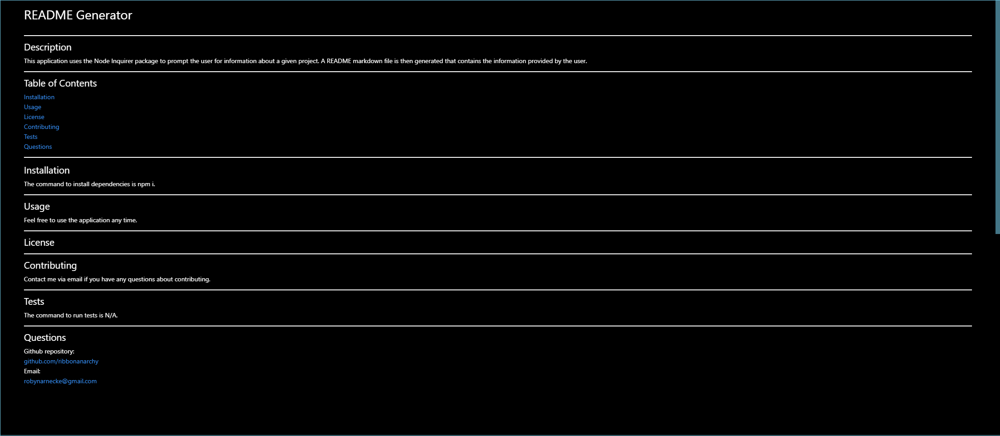

# README Generator    
    
---
    
Title: README Generator 
Developer: Robyn Arnecke

## Summary      

This application uses the Node Inquirer package to ask the user questions about their application. The answers provided by the user are then used to generate a README file for a given project. 

The above video should demonstrate the Node Inquirer package and the way that a user would interact with this application. 

## Development

This is a simple application that has a dependency on Node Inquirer. I began development by adding the questions into an array of objects to supply to the Inquirer package. Once I knew that the user's input was being stored correctly, I made sure that I could use fs filesystem to write to a README file correctly. After I knew that those two components worked correctly, I made sure the formatting was correct. 

This application does not include the ability to add badges for the type of license that the user chooses, but that is a goal for future development. 